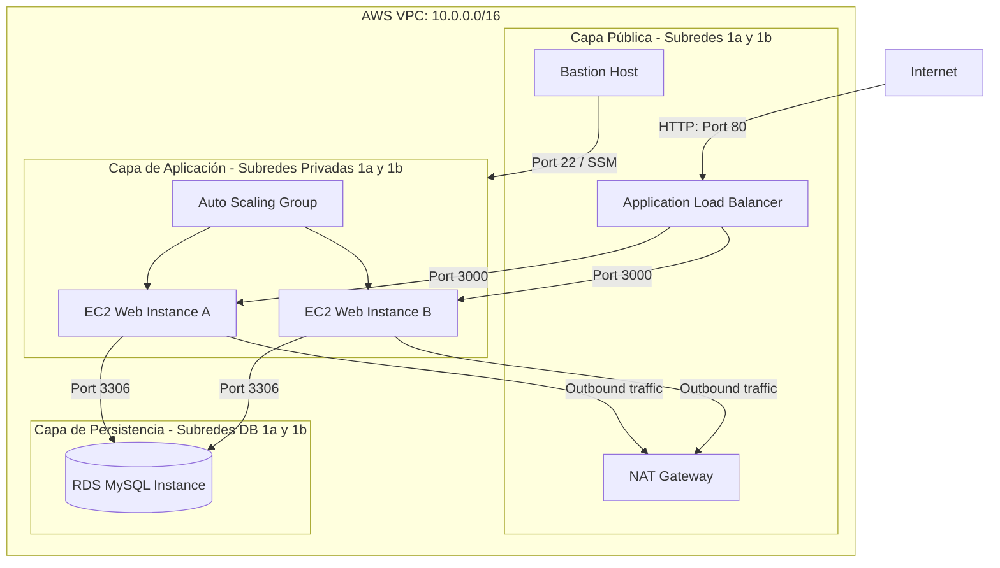

# ZAME SCENT - Plataforma de Comercio Electrónico Escalable en AWS

**Curso:** Infraestructura III  
**Docente:** Ing. Mario German Castillo Ramirez  
**Institución:** Facultad de Ingeniería, Departamento de Tecnologías de Información y Comunicaciones  
**Estudiante / Startup Developer:** Daniel y Carlos

---

## 🚀 Descripción del Proyecto

**ZAME SCENT** es una plataforma web redundante de comercio electrónico (E-commerce) de alta perfumería diseñada y construida bajo principios de **alta disponibilidad, escalabilidad horizontal automática y aislamiento de seguridad multicapa** en Amazon Web Services (AWS). 

La infraestructura completa está aprovisionada de forma 100% automatizada mediante **Infraestructura como Código (IaC) con Terraform**, garantizando despliegues idénticos y repetibles en entornos académicos y productivos.

---

## 📐 Arquitectura de la Solución

La infraestructura implementa una topología de red dividida de alta seguridad en una **VPC dedicada (`10.0.0.0/16`)**:



### Componentes Clave:
* **Red Segura**: VPC segmentada con 2 subredes públicas (para ALB y Bastión Host), 2 subredes privadas (para servidores web) y 2 subredes de base de datos aisladas.
* **Cómputo y Escalabilidad**: Auto Scaling Group (ASG) configurado con un mínimo de 2 instancias y un máximo de 4 (`t2.micro`), respaldado por un balanceador de carga de aplicación (ALB) que evalúa constantemente los `/health` checks en el puerto 3000.
* **Persistencia Robusta**: Base de datos gestionada AWS RDS con motor MySQL 8.0 colocada en subredes privadas exclusivas y protegida por un Security Group restrictivo.
* **Monitoreo y Alertas**: Alarmas de CloudWatch que detectan cuando el consumo promedio de CPU es mayor o igual al 80% y disparan políticas de escalado hacia el ASG e inyectan notificaciones a través de AWS SNS.
* **Seguridad sin Puertos Abiertos**: Administración de instancias privadas sin SSH externo, implementando **AWS Systems Manager (SSM) Session Manager** para un acceso administrativo seguro con auditoría completa de llamadas de API mediante CloudTrail.

---

## 📂 Estructura del Repositorio

El proyecto se encuentra organizado meticulosamente bajo la siguiente estructura:

* **[`/app`](file:///c:/Users/danie/Desktop/Zame/app)**: Código fuente de la aplicación web monolítica construida en Node.js (Express) con Sequelize ORM.
* **[`/terraform`](file:///c:/Users/danie/Desktop/Zame/terraform)**: Templates de Infraestructura como Código (`main.tf`, `variables.tf`, `outputs.tf`) y scripts de arranque (`user_data.sh`, `bastion_user_data.sh`).
* **[`/docs`](file:///c:/Users/danie/Desktop/Zame/docs)**: Documentación académica y técnica completa del proyecto.
* **[`/scripts`](file:///c:/Users/danie/Desktop/Zame/scripts)**: Scripts de automatización en PowerShell para el flujo de desarrollo local.

---

## 📘 Documentación Técnica y Entregables

Toda la documentación requerida para la sustentación y despliegue del proyecto se encuentra disponible en los siguientes enlaces directos:

1. 📄 **[Plan de Proyecto (docs/plan_proyecto.md)](file:///c:/Users/danie/Desktop/Zame/docs/plan_proyecto.md)**: Detalle del alcance académico, Estructura de Desglose de Trabajo (EDT), cronograma de fases y plan de mitigación de riesgos.
2. 🚀 **[Guía de Despliegue y Operación (docs/guia_despliegue.md)](file:///c:/Users/danie/Desktop/Zame/docs/guia_despliegue.md)**: Manual técnico paso a paso para validaciones locales (SQLite offline), preparación de bundles en S3, despliegue en AWS con Terraform y telemetría de fallos.
3. 💻 **[Estructura de la Presentación (docs/presentacion.md)](file:///c:/Users/danie/Desktop/Zame/docs/presentacion.md)**: Guion y slides técnicos recomendados para la sustentación final ante el jurado.
4. 🗺️ **[Diagramas de Arquitectura (docs/diagramas_arquitectura.md)](file:///c:/Users/danie/Desktop/Zame/docs/diagramas_arquitectura.md)**: Representaciones gráficas del flujo de tráfico de red, pasarelas de pago y topología AWS.

---

## ⚡ Guía de Inicio Rápido

### Pruebas Locales (Offline)
La aplicación web detecta automáticamente la ausencia del motor RDS en la nube y levanta una base de datos local relacional ligera basada en **SQLite**, ideal para desarrolladores:
```bash
cd app
npm install
npm run seed  # Carga el catálogo de perfumes de lujo
npm start
```
*Visita [http://localhost:3000](http://localhost:3000) en tu navegador.*

### Despliegue Automatizado en AWS (Terraform)
1. Navega a la carpeta de infraestructura:
   ```bash
   cd terraform
   terraform init
   ```
2. Configura tus credenciales y secretos copiando `terraform.tfvars.example` a `terraform.tfvars` e ingresando las contraseñas de la base de datos y llaves de simulación de pagos.
3. Ejecuta el aprovisionamiento completo:
   ```bash
   terraform apply -auto-approve
   ```
4. El sistema imprimirá la URL pública del balanceador de carga (`alb_dns_name`) al finalizar la inicialización.
