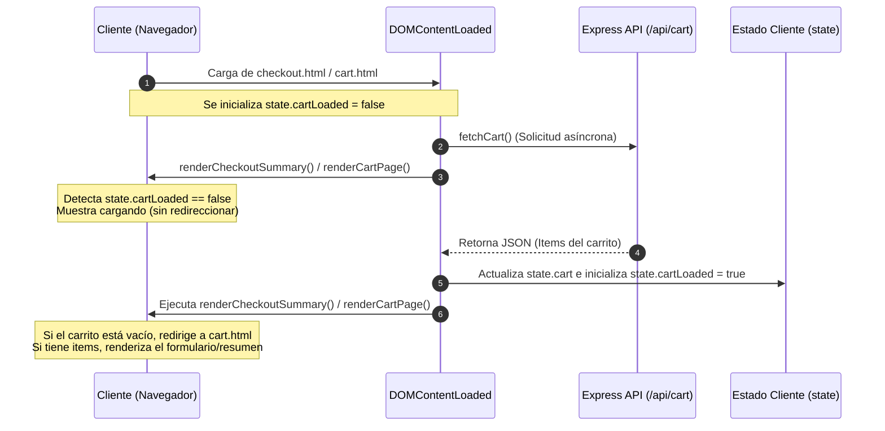
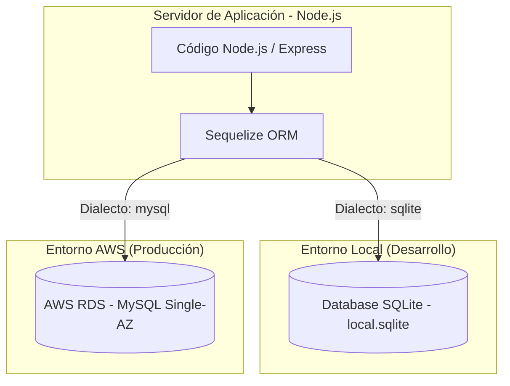
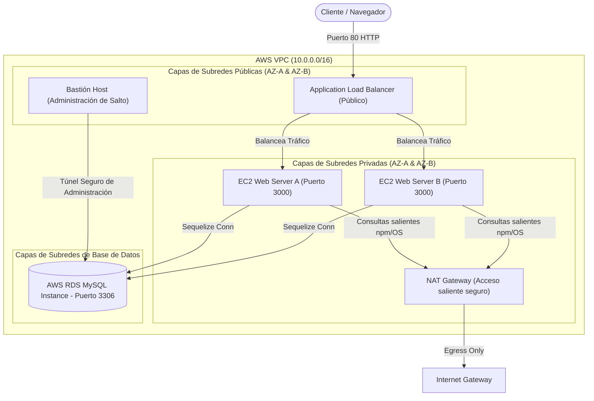
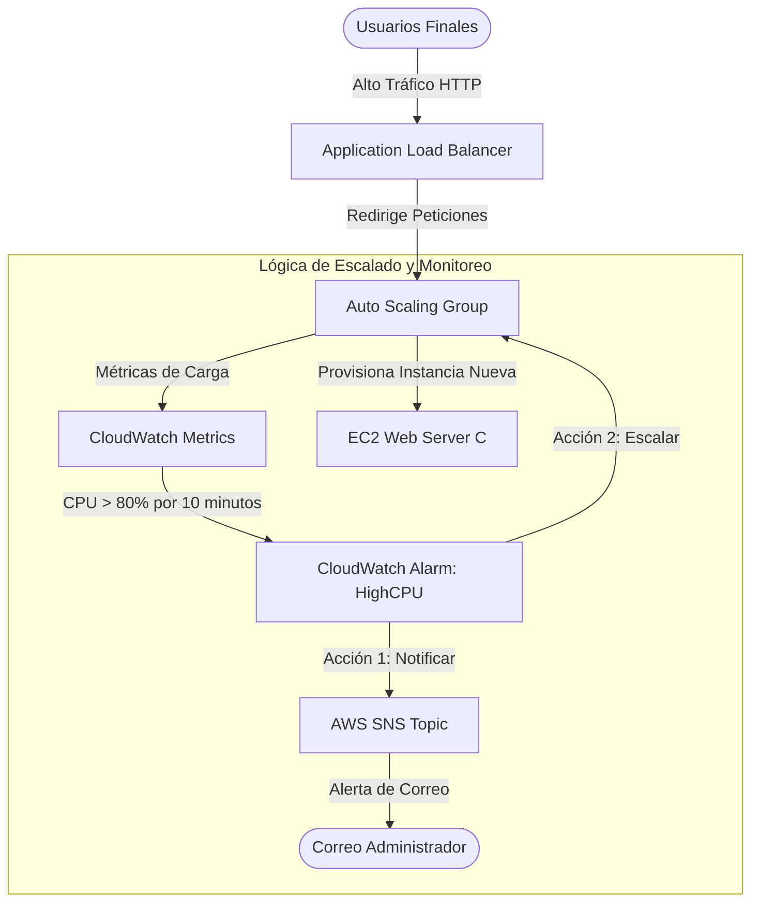
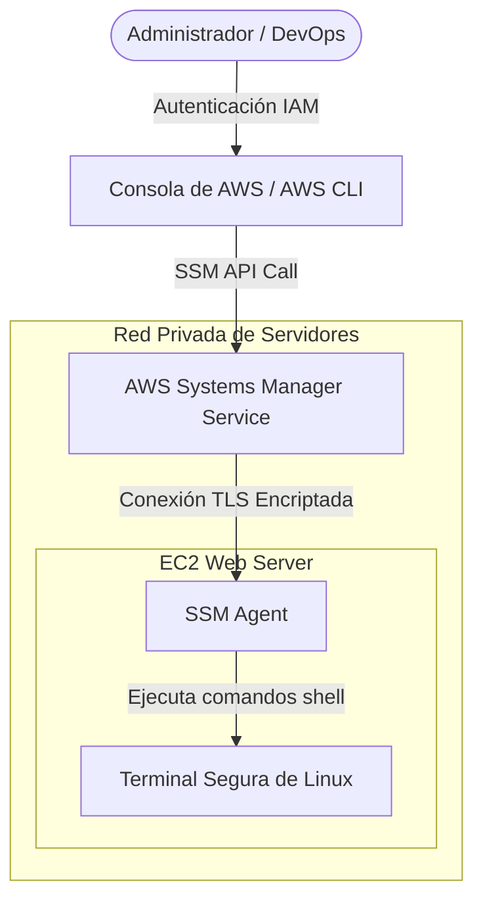

# Diagramas de Arquitectura y Explicaciones Detalladas

Este documento contiene diagramas visuales en formato Mermaid y explicaciones en profundidad de cada componente crítico de la arquitectura técnica, de red y de persistencia del proyecto **ZAME SCENT**.

---

## 1. Flujo de Sincronización Asíncrona (Solución a Race Condition)

El siguiente diagrama detalla cómo se resolvió la condición de carrera (*race condition*) del carrito de compras al cargar las vistas de la aplicación.

### Explicación
Anteriormente, al cargar `checkout.html`, el código del navegador evaluaba `state.cart` de forma síncrona. Dado que la petición AJAX `fetchCart()` no se había completado, `state.cart` estaba vacío (`[]`), provocando un redireccionamiento automático e incorrecto hacia `cart.html`.

**Solución Implementada**:
* Se introdujo una bandera de inicialización `state.cartLoaded = false`.
* Las funciones de renderizado ahora no ejecutan redirecciones ni asumen estados vacíos si la bandera `cartLoaded` es falsa. En su lugar, muestran un estado animado de carga (*Cargando...*).
* Al completarse la respuesta del servidor, se cambia la bandera a `true` y se invocan de nuevo los renderizadores, los cuales toman decisiones precisas de interfaz.

---

## 2. Persistencia Híbrida de Base de Datos (Sequelize ORM)

Este diagrama modela cómo el backend interactúa con diferentes motores relacionales dependiendo del entorno de ejecución local o de nube.

### Explicación
* **Sequelize ORM** funciona como una capa de abstracción de datos intermedia. El código de la aplicación realiza operaciones idénticas en Javascript (ej. `User.create()`, `Product.findAll()`) sin escribir código SQL directo.
* **Entorno de Desarrollo (Local)**: El archivo `database.js` lee variables de entorno. Si no detecta parámetros de AWS RDS, inicializa una conexión local segura sobre SQLite. Esto permite verificar el funcionamiento de las apis en computadores de desarrollo sin consumo de AWS.
* **Entorno de Producción (AWS Cloud)**: Al correr dentro de EC2, detecta las credenciales inyectadas del RDS MySQL e inicializa la persistencia relacional empresarial en la nube de forma transparente.

---

## 3. Arquitectura de Red VPC Segmentada en Capas

El diagrama a continuación describe la distribución de los componentes en subredes públicas y privadas, configuradas mediante Terraform en AWS.

### Explicación
* **Subred Pública**: El ALB recibe el tráfico web directo del exterior. Posee reglas para redirigir peticiones balanceadas exclusivamente al puerto `3000` de las subredes privadas. El Bastión Host se expone aquí sólo para casos de contingencia de redes.
* **Subred Privada**: Aloja los servidores de aplicación EC2. No tienen IPs públicas asignadas y no son alcanzables directamente desde internet. Si necesitan actualizar dependencias de software o comunicarse con servicios externos, viajan de forma saliente (*egress*) a través del **NAT Gateway** (que traduce y oculta su tráfico).
* **Subred de Base de Datos**: Aislada completamente del tráfico público y privado común. Solo admite conexiones entrantes provenientes del Security Group de la Capa Privada en el puerto `3306`.

---

## 4. Telemetría y Flujo de Escalado Automático (ASG & CloudWatch)

El siguiente gráfico ilustra cómo reacciona la infraestructura ante incrementos severos de tráfico de red y carga transaccional.

### Explicación
* El **Application Load Balancer** distribuye peticiones uniformemente.
* Las métricas de consumo de CPU de todas las instancias activas se envían constantemente a **Amazon CloudWatch**.
* Si la CPU promedio supera el 80% durante dos periodos de 5 minutos, se activa una alarma crítica:
  1. Envía un mensaje estructurado a **Amazon SNS**, el cual notifica al correo configurado por el DevOps.
  2. Instruye al **Auto Scaling Group** para lanzar inmediatamente una nueva instancia EC2 pre-aprovisionada usando el Launch Template de producción, mitigando la sobrecarga y normalizando el tiempo de respuesta.

---

## 5. Ruta de Acceso Administrativo Seguro (SSM Session Manager)

Este flujo detalla cómo se gestiona y audita el acceso administrativo a los sistemas sin necesidad de contraseñas de red tradicionales ni puertos SSH expuestos.

### Explicación
* En lugar de abrir el puerto 22 en la red para acceder por consola SSH a los servidores internos, la seguridad se delega a **AWS Systems Manager**.
* El administrador se autentica en AWS mediante Single Sign-On o llaves de API IAM autorizadas.
* El servicio SSM se comunica de manera bidireccional con el software interno **SSM Agent** que corre dentro de Linux en la instancia EC2 privada.
* Se abre un canal interactivo seguro y encriptado directamente en la consola web o terminal local de DevOps. Todos los comandos ejecutados quedan logueados y auditados a nivel empresarial sin fugas de credenciales de red.
